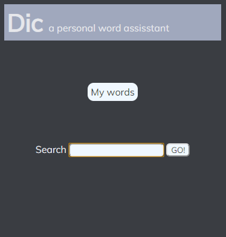
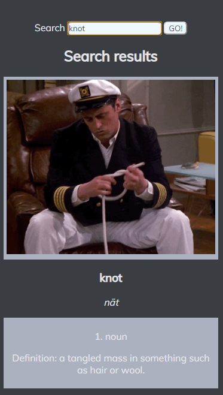
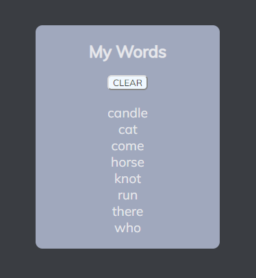

# Dic

Dic is your personal dictionary assisstant. Look up words, get the definition and a GIF to help drive that understanding of the word. Keeps track of the words you don't understand.

## Motivation

Personal app to keep track of words you are learning.

## Screenshots

Home Screen/Landing Page:

Search:

Search History:

## Built With

- HTML5
- CSS
- Javascript
- JQuery

## Features

- Search English words
- Keep a log of your search words
- Clear your list

## Link to Project

https://damarriott.github.io/dic/

## Author

- **D A Marriott**
